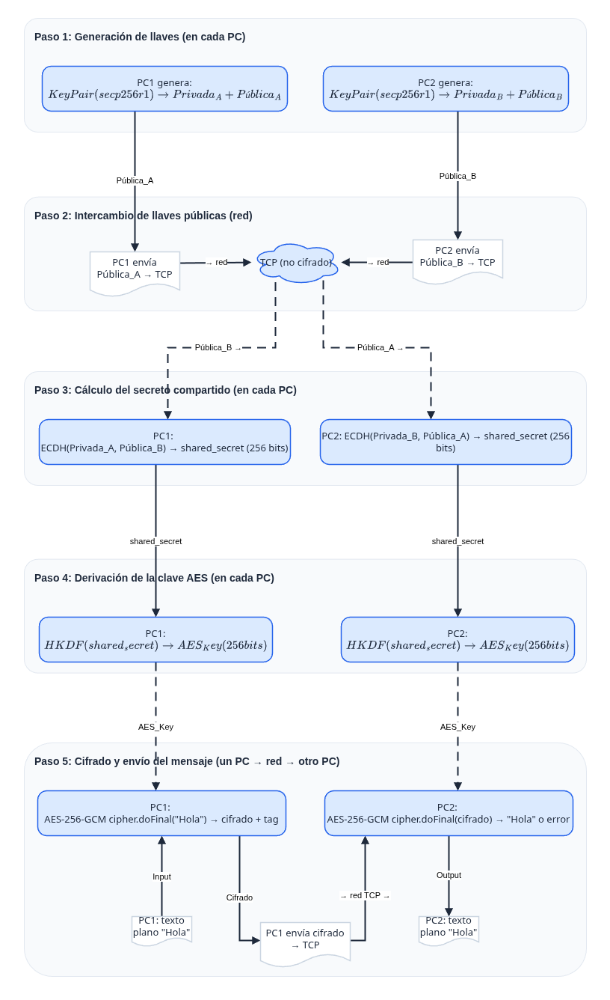

# Encrypted Chat Java

> Aplicacion de chat cifrado peer-to-peer con intercambio de claves ECDH y cifrado AES-256-GCM.

[Informe completo →](docs/informe.md)

## Descripcion

Chat de consola en Java puro (sin dependencias externas) que permite a dos usuarios comunicarse de forma segura a traves de una red TCP. Implementa cifrado de extremo a extremo usando criptografia de curva eliptica y AES.

## Esquema de criptografia



## Caracteristicas

- **ECDH secp256r1** — Intercambio de claves mediante curva eliptica P-256
- **AES-256-GCM** — Cifrado autenticado de mensajes (confidencialidad + integridad)
- **HKDF-SHA-256** — Derivacion de claves segura (RFC 5869)
- **Claves efimeras** — Perfect Forward Secrecy (PFS)
- **Sin dependencias** — Solo utiliza el JDK estandar (Java 11+)
- **Observador de sesion** — Visualizacion en tiempo real del protocolo criptografico

---

## Requisitos

- Java 11 o superior
- Docker (opcional, para ejecucion en contenedores)

---

## Compilacion

```bash
./scripts/build.sh
```

Genera dos archivos en `build/`:
- `encrypted-chat.jar` — aplicacion principal de chat
- `observer.jar` — observador de sesion

## Tests

```bash
./scripts/test.sh
```

---

## Modo 1 — Ejecucion local (sin Docker)

Requiere Java instalado en ambas maquinas.

**Maquina A (servidor):**
```bash
java -jar build/encrypted-chat.jar server --port 5050 --name Alicia
```

**Maquina B (cliente):**
```bash
java -jar build/encrypted-chat.jar client --host IP_MAQUINA_A --port 5050 --name Bruno
```

Para salir del chat: `/salir`

---

## Modo 2 — Ejecucion con Docker (dos maquinas)

No requiere Java ni codigo fuente en la maquina remota, solo Docker.

### Construir y publicar la imagen

```bash
docker build -t andresb420/encrypted-chat:latest .
docker push andresb420/encrypted-chat:latest
```

### En cada maquina

**Maquina A (servidor):**
```bash
docker run -it -p 5050:5050 andresb420/encrypted-chat:latest server --port 5050 --name Alicia
```

**Maquina B (cliente):**
```bash
docker run -it andresb420/encrypted-chat:latest client --host IP_MAQUINA_A --port 5050 --name Bruno
```

### Simulacion local con Docker Compose

Para probar ambos roles en una sola maquina:

```bash
docker-compose up --build
```

Para adjuntarse a cada contenedor e interactuar:
```bash
docker attach encrypted-chat-java-server-1
docker attach encrypted-chat-java-client-1
```

---

## Observador de sesion

El observador muestra en tiempo real todos los valores internos del protocolo: claves, nonces, texto plano, frames TCP cifrados, fingerprint y resultado de la confirmacion HMAC.

Siempre corre directamente en tu maquina (sin Docker).

### Con ejecucion local

**Terminal 1 — arrancar el observador:**
```bash
java -jar build/observer.jar
```

**Terminal 2 — servidor con observe activo:**
```bash
java -jar build/encrypted-chat.jar server --port 5050 --name Alicia --observe
```

**Terminal 3 — cliente con observe activo:**
```bash
java -jar build/encrypted-chat.jar client --host 127.0.0.1 --port 5050 --name Bruno --observe
```

### Con Docker (contenedores apuntando al observador del host)

**Terminal 1 — arrancar el observador en tu maquina:**
```bash
java -jar build/observer.jar
```

**Terminal 2 — servidor Docker:**
```bash
docker run -it -p 5050:5050 \
  -e OBSERVER_HOST=host.docker.internal \
  andresb420/encrypted-chat:latest server --port 5050 --name Alicia --observe
```

**Terminal 3 — cliente Docker:**
```bash
docker run -it \
  -e OBSERVER_HOST=host.docker.internal \
  andresb420/encrypted-chat:latest client --host host.docker.internal --port 5050 --name Bruno --observe
```

> `host.docker.internal` es la direccion que Docker Desktop usa para referirse a tu maquina host. Funciona en Windows y Mac. En Linux usar la IP de la interfaz `docker0` (normalmente `172.17.0.1`).

### Con Docker en dos maquinas reales

El observador corre en la Maquina A. Ambos contenedores envian sus eventos a esa maquina.

**Maquina A — observador + servidor:**
```bash
# Terminal 1
java -jar build/observer.jar

# Terminal 2
docker run -it -p 5050:5050 -p 7777:7777/udp \
  -e OBSERVER_HOST=host.docker.internal \
  andresb420/encrypted-chat:latest server --port 5050 --name Alicia --observe
```

**Maquina B — cliente apuntando al observador de Maquina A:**
```bash
docker run -it \
  -e OBSERVER_HOST=IP_MAQUINA_A \
  andresb420/encrypted-chat:latest client --host IP_MAQUINA_A --port 5050 --name Bruno --observe
```

> Asegurarse de que el puerto UDP 7777 este abierto en el firewall de Maquina A.

---

## Opciones disponibles

| Opcion | Descripcion | Aplica a |
|---|---|---|
| `--port` | Puerto TCP (default: 5050) | server, client |
| `--host` | IP o hostname del servidor | client |
| `--name` | Nombre del usuario en el chat | server, client |
| `--bind` | Direccion de escucha (default: 0.0.0.0) | server |
| `--observe` | Activa el envio de eventos al observador | server, client |

| Variable de entorno | Descripcion | Default |
|---|---|---|
| `OBSERVER_HOST` | Host donde corre el observador | `localhost` |

---

## Autores

- [Andres Bueno](https://github.com/AndresBueno420)
- [Sebastian Erazo](https://github.com/Sebas41)
- [Rony Ordoñez](https://github.com/RonyOz)

## Licencia

Proyecto academico.
